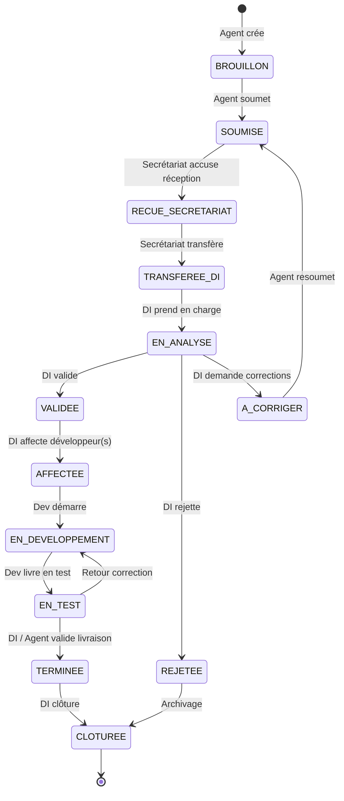

# Statuts et workflow DDL

## Diagramme des statuts

## Table des statuts

| Code | Libellé | Description | Qui peut voir |
|------|---------|-------------|---------------|
| `BROUILLON` | Brouillon | Demande en cours de rédaction | Agent (auteur) |
| `SOUMISE` | Soumise | Formulaire complet, PDF généré | Agent, Secrétariat, DI, Admin |
| `RECUE_SECRETARIAT` | Reçue secrétariat | Accusé de réception administratif | Idem |
| `TRANSFEREE_DI` | Transférée DI | Transmise à la Direction Informatique | Idem |
| `EN_ANALYSE` | En analyse | Étude technique / métier par la DI | Idem |
| `VALIDEE` | Validée | Acceptée pour développement | Idem + Dev (si affecté) |
| `REJETEE` | Rejetée | Refusée avec motif obligatoire | Idem |
| `A_CORRIGER` | À corriger | Retour à l'agent pour compléments | Agent, DI, Admin |
| `AFFECTEE` | Affectée | Développeur(s) assigné(s) | Idem + Dev affecté |
| `EN_DEVELOPPEMENT` | En développement | Travaux en cours | Idem |
| `EN_TEST` | En test | Phase de recette / tests | Idem |
| `TERMINEE` | Terminée | Livraison acceptée | Idem |
| `CLOTUREE` | Clôturée | Dossier archivé | Tous (lecture selon rôle) |

## Transitions autorisées par rôle

| De → Vers | Agent | Secrétariat | DI | Développeur | Admin |
|-----------|:-----:|:-----------:|:--:|:-----------:|:-----:|
| BROUILLON → SOUMISE | ✓ | | | | ✓ |
| SOUMISE → RECUE_SECRETARIAT | | ✓ | | | ✓ |
| RECUE_SECRETARIAT → TRANSFEREE_DI | | ✓ | | | ✓ |
| TRANSFEREE_DI → EN_ANALYSE | | | ✓ | | ✓ |
| EN_ANALYSE → VALIDEE / REJETEE / A_CORRIGER | | | ✓ | | ✓ |
| A_CORRIGER → SOUMISE | ✓ | | | | ✓ |
| VALIDEE → AFFECTEE | | | ✓ | | ✓ |
| AFFECTEE → EN_DEVELOPPEMENT | | | | ✓ | ✓ |
| EN_DEVELOPPEMENT → EN_TEST | | | | ✓ | ✓ |
| EN_TEST → TERMINEE | | | ✓ | ✓ | ✓ |
| EN_TEST → EN_DEVELOPPEMENT | | | ✓ | | ✓ |
| TERMINEE → CLOTUREE | | | ✓ | | ✓ |
| REJETEE → CLOTUREE | | | ✓ | | ✓ |

## Champs obligatoires lors d'une transition

| Transition | Champ requis |
|------------|--------------|
| Vers `REJETEE` | `motif_rejet` (texte, min 20 car.) |
| Vers `A_CORRIGER` | `commentaire` (texte, min 20 car.) |
| Vers `AFFECTEE` | `developpeur_ids` (≥1 utilisateur rôle DEV) |
| Vers `CLOTUREE` | — (action DI ou auto après délai paramétrable — hors MVP) |

## Numérotation DDL-AAAA-NNN

- **AAAA** : année civile de la première soumission
- **NNN** : séquence sur 3 chiffres, remise à zéro chaque 1er janvier
- Exemple : `DDL-2026-001`, `DDL-2026-002`, …
- Attribution **atomique** en base (séquence ou table `numerotation_ddl`)

## Notifications déclenchées

| Événement | Destinataires | Canal MVP |
|-----------|---------------|-----------|
| Soumission | Secrétariat | In-app |
| Transfert DI | DI | In-app |
| Validation / Rejet / À corriger | Agent | In-app |
| Affectation | Développeur(s) | In-app |
| Changement statut dev | DI, Agent | In-app |
| Clôture | Agent, DI | In-app |

## Historique des actions

Chaque transition enregistre :
- `demande_id`, `ancien_statut`, `nouveau_statut`
- `utilisateur_id`, `role`, `commentaire` (optionnel)
- `created_at`

Conservation illimitée en MVP.
