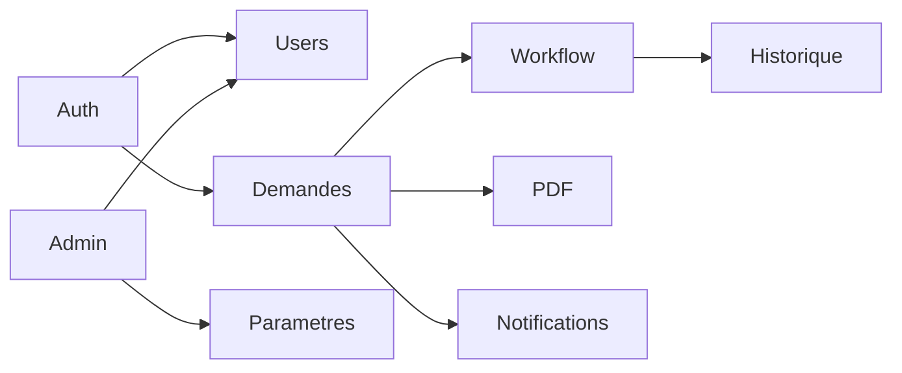

# Phase 1 — Conception technique

Livrables de conception pour la plateforme DDL CENI RDC.

| # | Livrable | Fichier |
|---|----------|---------|
| 1 | Schéma PostgreSQL (Prisma) | `backend/prisma/schema.prisma` |
| 2 | Spécification API REST | [01-api-rest.md](./01-api-rest.md) |
| 3 | Maquettes interface | [02-maquettes.md](./02-maquettes.md) |
| 4 | Diagramme entités | [03-erd.md](./03-erd.md) |

## Stack confirmée

- **Backend** : NestJS, Prisma, JWT, PostgreSQL
- **Frontend** : React, Vite, TypeScript, Tailwind CSS
- **PDF** : Puppeteer ou `@react-pdf/renderer` (décision Phase 4)

## Dépendances entre modules API

## Prochaine étape

Phase 2 — Scaffolding : repo, NestJS, Vite, page login, auth JWT.
