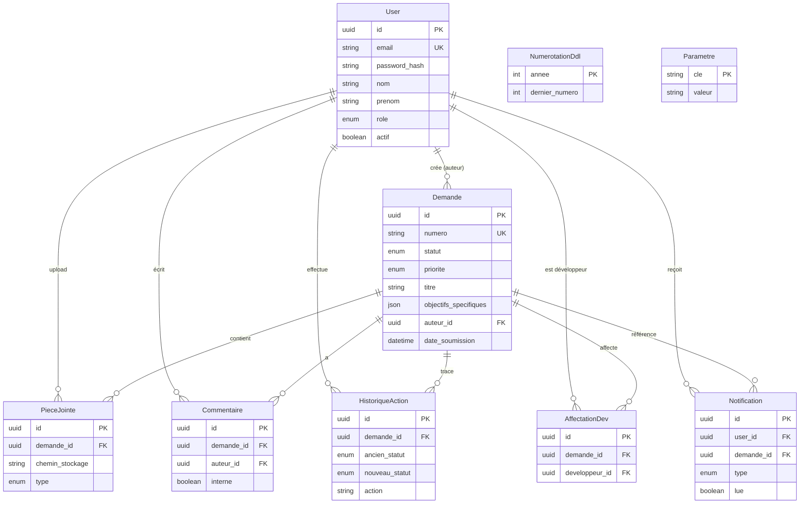

# Diagramme entités — PostgreSQL

## Index principaux

| Table | Index | Raison |
|-------|-------|--------|
| `demandes` | `statut`, `auteur_id`, `date_soumission` | Filtres listes / KPI |
| `notifications` | `(user_id, lue)` | Badge non lues |
| `historique_actions` | `demande_id`, `created_at` | Timeline |
| `affectations_dev` | `developpeur_id` | Dashboard dev |

## Volumes estimés (année 1)

| Table | Estimation |
|-------|------------|
| users | 50–200 |
| demandes | 200–500 |
| historique_actions | 2 000–5 000 |
| notifications | 5 000–15 000 |
